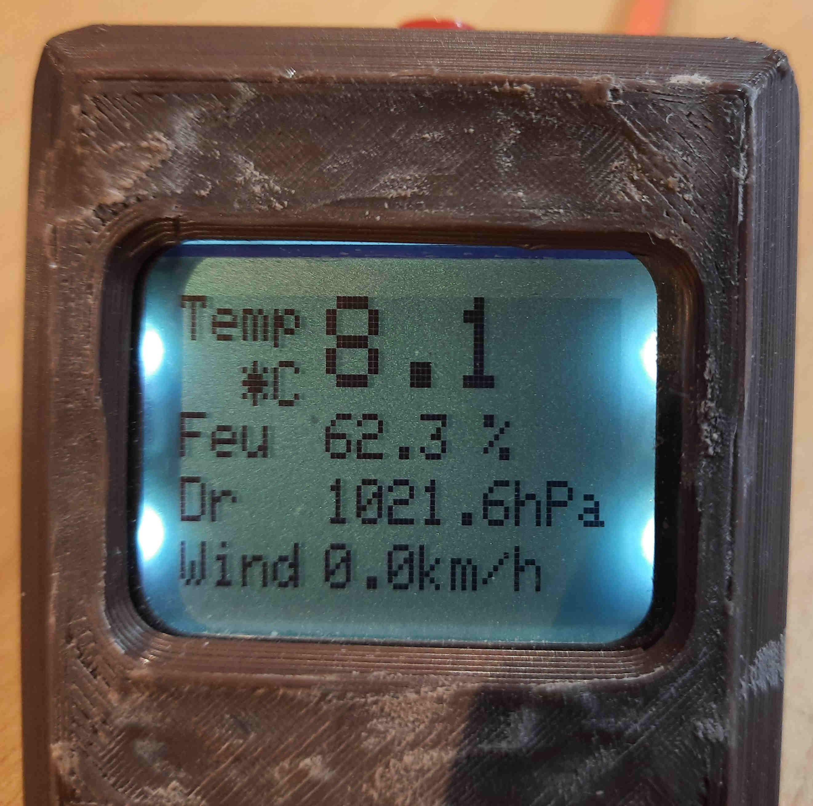
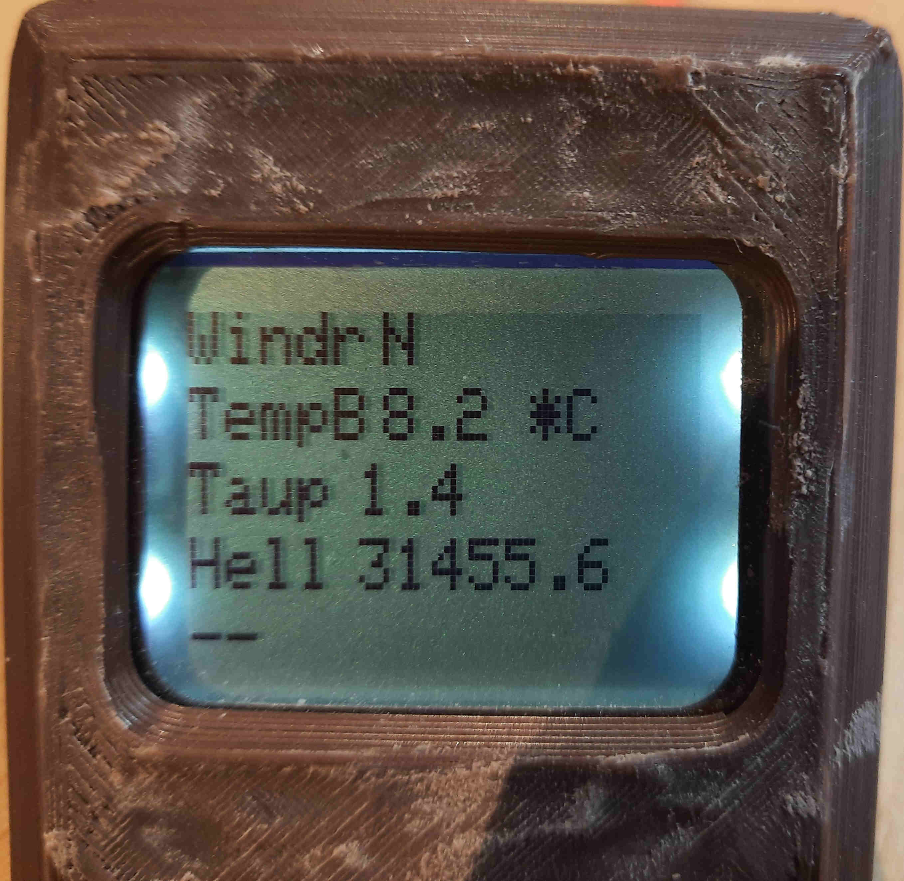
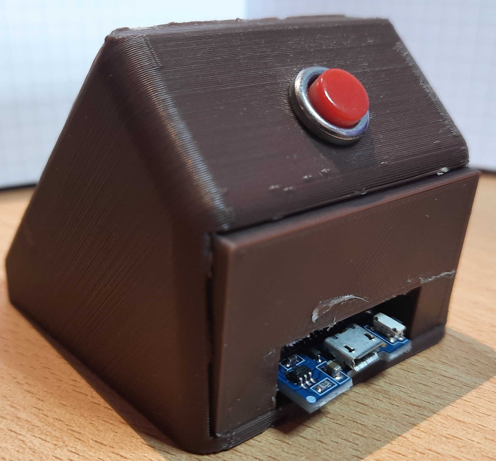
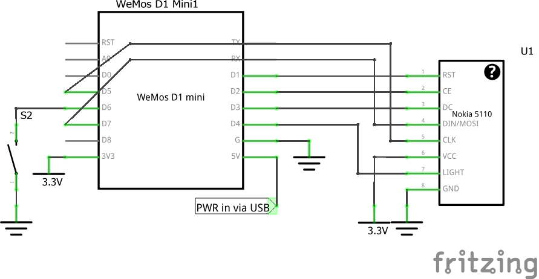
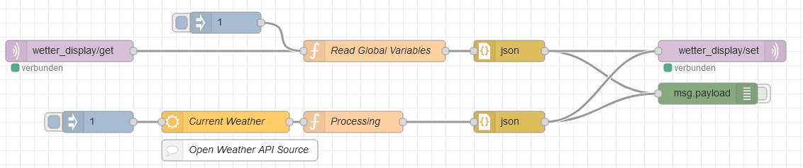
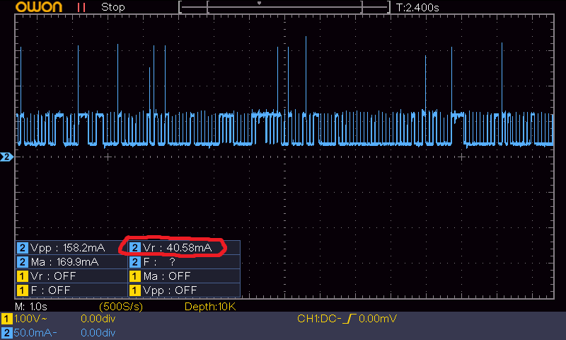

# MQTT-Weather-display
Nokia 5110 MQTT Weather Display (Also works with Openweathermap)

This is how to build a MQTT Weather Display based on the Nokia 5110 Display and an ESP8266 to show the current temperature and other weather data.

  

# How it works
The display is sending a request via MQTT to the server, where this request is processed on Node Red. Node Red responds with an JSON message, which contains the weather data. This data is then displayed on the Nokia 5110 display.

# Hardware
The schematic looks like this:

The whole system is mounted in a 3D-printed enclosure which I found on thingiverse (https://www.thingiverse.com/thing:3725377). I modified it a bit to fit my needs. You can find the stl files on github. 
The Case is designed to fit for a WEMOS D1 Mini Board.

The device also has a pushbutton with the following function:
-	short press: activate LCD backlight for a defined time
-	long press: show page two with additional measurements and activate LCD backlight
-	double press: force the display to update the values

# Software
You can find the software for the ESP on Github. It uses some external libraries which are linked to in the code.
 **!!!!! IMORTANT: I noticed that you have to increase the MQTT_MAX_PACKET_SIZE in the PubSubClient.h file to at least 1024**
 (Located on Windows at `C:\Users\*YOUR_USERNAME*\Documents\Arduino\libraries\pubsubclient-master\src\PubSubClient.h`).
 Otherwise the display won’t receive the messages because they are quiet long.

The Node Red flow is quite simple:
 
 
You can import it using the given json file on Github. Notice that I get the weather data from my own weather station  which is stored in global variables in Node Red. 
I also included another flow which will make the display work getting the data from the Openweathermap API (Source: https://flows.nodered.org/flow/b5b7d5da14d24e71de447e6aa290937e/in/dbKdTXPTnHBx . This page also describes how to setup the API). You just need to delete the “Read global Variables” function and connect the Openweathermap function instead. Don’t forget to set your Location correctly.

# Power Consumption
After a short time with now WLAN traffic the ESP goes into an auto sleep mode, where the power consumption is reduced to an average value of around 40mA. This mode is enabled by default. It wakes up every view milliseconds to check for incoming traffic. This looks like this: 

I also tried to switch off the WIFI completely while not receiving any messages but this didn’t work out and the ESP often crashes.

### I hope you like this project!

This work by Dustin Brunner is licensed under <a rel="license" href="https://creativecommons.org/licenses/by/4.0">CC BY 4.0</a>

 Dieses Werk von Dustin Brunner ist lizenziert unter einer <a rel="license" href="http://creativecommons.org/licenses/by/4.0/">Creative Commons Namensnennung 4.0 International Lizenz</a>.
